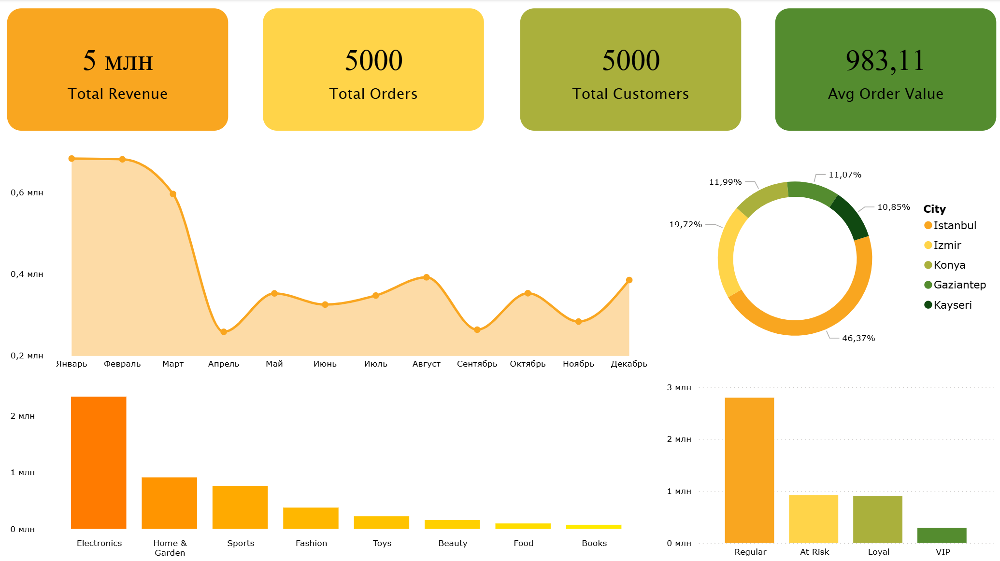

# E-commerce Data Analysis & Customer Segmentation

## Project Overview

This project analyzes e-commerce transaction data to uncover key business insights related to sales performance, customer behavior, and product trends.

The analysis includes **data cleaning, exploratory data analysis (EDA), customer segmentation using RFM methodology, and an interactive Power BI dashboard**.

---

## Objectives

* Identify top-performing products and cities
* Analyze revenue trends over time
* Segment customers based on purchasing behavior
* Provide actionable business recommendations

---

## Tools & Technologies

* **Python (Pandas)** – Data cleaning & analysis
* **SQL** – Data querying
* **Power BI** – Dashboard & visualization
* **GitHub** – Project version control

---

## Data Cleaning & Preparation

* Converted date column to datetime format
* Removed duplicates and validated data consistency
* Verified revenue calculations (`Total_Amount`)
* Created new features (Month, Weekday, Avg Price per Item)

---

## Customer Segmentation (RFM Analysis)

Customers were segmented using:

* **Recency** – Days since last purchase
* **Frequency** – Number of orders
* **Monetary** – Total spending

### Segments:

* VIP Customers
* Loyal Customers
* Regular Customers
* At-Risk Customers

---

## Dashboard Overview

The Power BI dashboard includes:

* Revenue trend over time
* Revenue by city
* Revenue by product category
* Revenue by customer segment
* Returning vs new customers
* Customer rating analysis

---

## Dashboard Preview



---

## Key Insights

* A small percentage of customers generate the majority of revenue
* Certain cities dominate overall sales performance
* VIP and loyal customers contribute significantly to total revenue
* Returning customers show higher spending behavior

---

## Business Recommendations

* Focus marketing campaigns on high-value (VIP) customers
* Retarget at-risk customers with promotions
* Invest in top-performing product categories
* Improve delivery time to enhance customer satisfaction

---

## Project Structure

```
ecommerce-data-analysis/
│
├── data/
├── notebooks/
├── sql/
├── dashboard/
├── images/
└── README.md
```

---

## How to Run the Project

1. Open `notebooks/analysis.ipynb`
2. Run all cells for data cleaning and analysis
3. Open Power BI dashboard file

---

## Author

This project was built as part of a data analyst portfolio to demonstrate real-world analytical and business intelligence skills.
